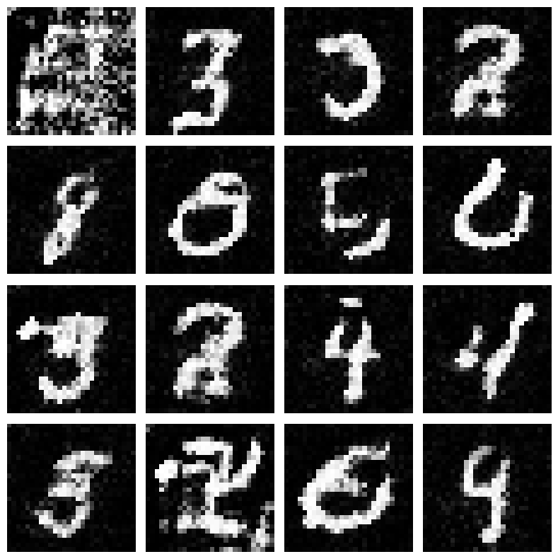

## Joint Energy-Based Model (JEM)

Le **JEM** est un algorithme qui peut être utilisé pour générer des images réalistes à partir de bruit, tout en effectuant des tâches de **classification**. L'objectif est de prendre une image bruitée en entrée et de la rendre plus nette au fur et à mesure de l'entraînement, jusqu'à obtenir une image réaliste. Le modèle JEM combine ainsi à la fois des capacités de **génération d'images** et de **classification d'images**.

## Fonctionnement

Le modèle JEM repose sur un **réseau de neurones convolutionnel (CNN)** qui prend en entrée une image (réelle ou bruitée) et applique plusieurs couches de convolutions pour extraire des caractéristiques importantes de l'image. Le modèle utilise l'activation **swish** (x * sigmoid) entre les couches pour favoriser une meilleure représentation des données.

En sortie de ce CNN, deux valeurs sont produites :
- **Energy** : Cette valeur représente la probabilité qu'une image soit réelle. Plus l'énergie est faible, plus l'image est jugée réelle. Inversement, une énergie élevée indique que l'image est plus probable d'être générée (fausse).
- **Classification** : JEM permet également de classifier l'image. Contrairement à un modèle EBM classique, JEM entraîne le CNN à prédire la classe de l'image (par exemple, dans ce TP les chiffres de MNIST).

L'énergie calculée, ainsi que la classification, sont utilisées pour appliquer l'**équation de Langevin Dynamics**. Ce processus sert à optimiser l'image en enlevant progressivement le bruit afin de la rendre plus réaliste.

## Loss

La fonction de perte utilisée pour l'entraînement du modèle JEM est composée de trois loss :

1. **Classification Loss** : Une perte de type **cross-entropy** comparant la classe réelle de l'image et la classe prédite. Cette loss est importante car elle permet d'améliorer la prédiction de la classe de l'image

2. **Contrastive Divergence Loss** (CD) : Cette perte a pour but de maximiser la différence d'énergie entre les images réelles et générées. Elle aide à différencier les vraies images des fausses.
3. **Regularization** : Cette régularisation permet de stabiliser l'apprentissage et d'éviter que l'énergie ne devienne trop élevée.

## Architecture

Le modèle JEM repose sur un **CNN** avec plusieurs couches de convolution pour extraire les caractéristiques des images. Le réseau génère deux sorties : une pour l'**énergie** et une pour la **classification de l'image**.

L'algorithme utilise également **Langevin Dynamics** pour générer des images réalistes à partir de bruit, en ajustant les pixels de l'image au fil des itérations pour minimiser l'énergie.

