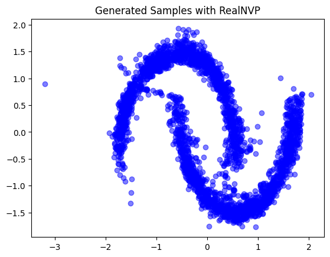

## Flow Based Model (RealNVP)

Le **RealNVP** est un algorithme de génération de données à partir d'une distribution simple. Autrement dit, l'algorithme apprend à transformer une distribution réelle (complexe) en une distribution simple, suivant une distribution Gaussienne. Ensuite le processus est inversé afin de générer à partir d'une distribution gaussienne aléatoire une image réelle. 
Cette technique peut s'avérer très utile pour créer de nouvelles données réalistes pour aggrandir un dataset.

## Fonctionnement

### Entrainement 

Lors de l'entrainement le modèle prend en entrée des données réelles (dans ce TP, des données en 2D x,y représentant 2 croissants de lune) et l'envoie dans une suite de **Coupling Layers** jusqu'à obtenir une distribution simple (distribution gauss).

Lors du passage dans une coupling Layers, un masque est appliqué sur les données afin de les séparer en 2 (xa et xb).

- xa reste inchangé
- xb se voit appliqué une fonction de transformation (scale et translate)

Ce processus est répété sur plusieurs Coupling Layers, avec des masques alternés, jusqu'à transformer les données en distribution Gaussienne.

### Inférence

Lors de l'inférence, le processus est inversé :

- On créer un ensemble de données suivant une distribution gaussienne

- On applique les transformations inverses du modèle (inverse les fonctions appliqué sur xb)

- On obtient ainsi une nouvelle donnée réaliste appartenant à la distribution d'origine. (ex : une nouvelle image du croissant de lune)

Ce mécanisme permet de générer des données qui suivent la distribution réelle des données d'entraînement.

## Loss

La loss va mesurer à quel point les points transformés ressemblent à une distribution Gaussienne.

Elle va donc calculer la probabilité p(z) que ces points sont sous une distribution normale.

Elle prend également en compte les transformations appliquées sur les données grâce au Jacobian qui mesure l’effet des Coupling Layers sur la densité des données.

Ainsi :

- Si z suit parfaitement une Gaussienne → la loss est petite (bon modèle).

- Si z est loin d’une Gaussienne → la loss est grande (mauvais modèle).

L’objectif de l’entraînement est de minimiser cette loss pour que les données transformées ressemblent le plus possible à une distribution normale. 

Cette loss est ensuite envoyé à travers le modèle afin de modifier les poids et biais des fonction linéaire des différentes coupling layers.

## Architecture

RealNVP est un modèle de Normalizing Flow composé de plusieurs **Coupling Layers** permettant d'assurer l'inversibilité des fonctions et réduit le temps de calcul.

Ces **Coupling Layers** permettent de diviser les données d'entrée en 2 parties (xa et xb).

On utilise également l'optimizer Adam.

